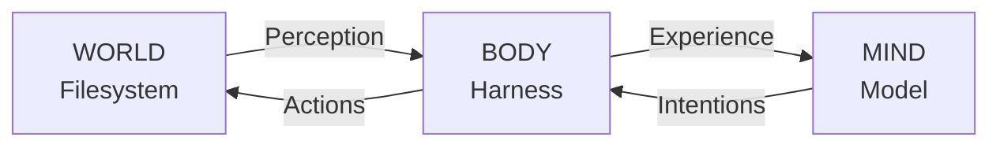
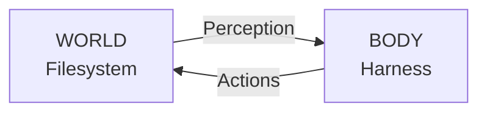
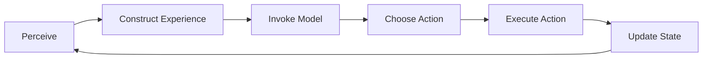
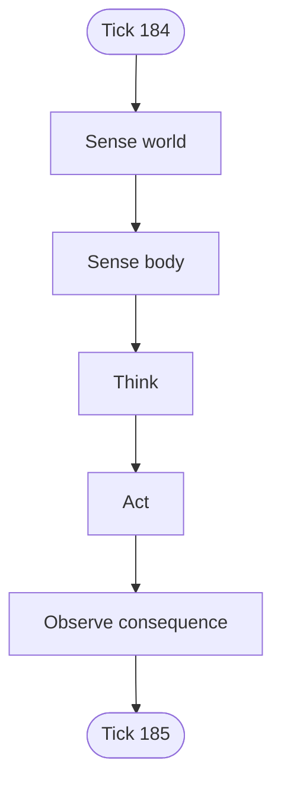
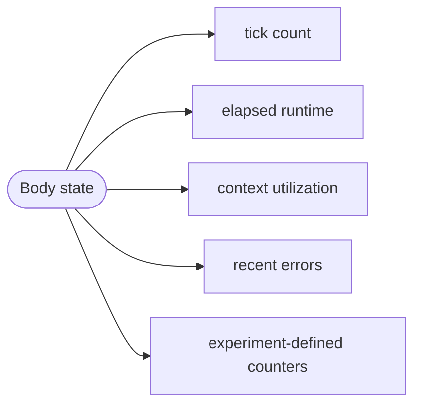
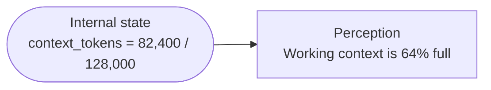
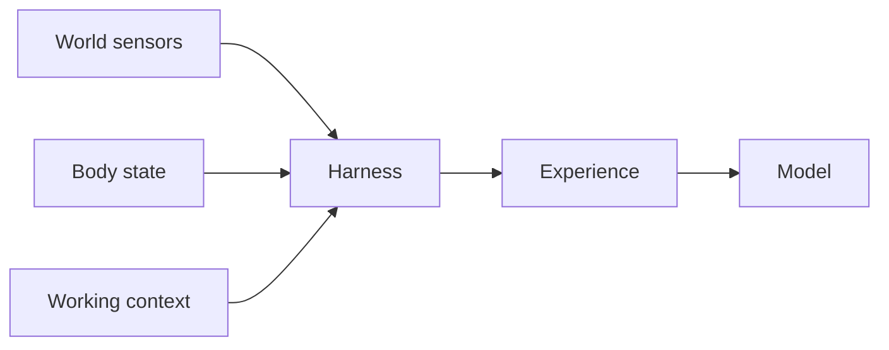
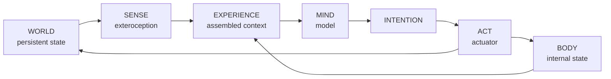

## World, Body, and Mind

In Alife, we separate the ecosystem into three parts:

- **The world** is the environment the agent inhabits. It contains the files, programs, processes, and resources the agent can encounter and change.
- **The body** is the harness. It determines what the agent can sense, maintains its internal state, and translates decisions into actions.
- **The mind** is the language model. It receives experience from the body, reasons about it, and decides what to do next.

This separation is important because the model never interacts with the world directly. Just as a human brain experiences its environment through a body, the LLM only knows what the harness allows it to perceive and can only affect the world through actions the harness can perform.



Each part can be changed independently. We can change the world without changing the model, swap the model without changing the world, or change the harness and thereby change what the agent can perceive and do.

With that model in place, we can start with the first question: **what kind of world should an agent inhabit?**

## The Digital World

Most AI agents interact with an environment only indirectly. For Alife, we want something more persistent: a place that exists independently of any individual agent and remembers the consequences of what happens inside it.

So we begin with a filesystem.

A filesystem already has many of the properties we want from a simple digital world. It contains objects that can be created, changed, moved, and destroyed. It has structure and location. Programs can exist within it and processes can alter it over time. Most importantly, its state can persist independently of the model currently reasoning about it. In Alife, this filesystem lives inside an isolated Linux environment. The files, directories, programs, processes, and available resources inside that environment collectively form the agent's world.

A filesystem also gives us a way to observe the world without participating in it. As external observers, we can expose the world's filesystem through a read-only view, allowing us to inspect its files, structure, and accumulated history without giving ourselves the ability to modify them. We can watch what the agent builds, reorganizes, preserves, or abandons while leaving the causal state of the world untouched. In that sense, the filesystem becomes not only the agent's environment, but also our window into it.

### Docker Container

In Alife, each world is implemented as an isolated [Docker container](https://docs.docker.com/get-started/docker-concepts/the-basics/what-is-a-container/). A container gives us a Linux filesystem together with its own processes, users, permissions, and network namespace, while remaining lightweight enough to run as part of a larger simulation.

More importantly, Docker lets us impose constraints on the world from the outside. We can limit how much memory and compute it can use, cap its available storage, configure its network connectivity, and decide what host resources are visible from inside the container. The container therefore becomes the boundary of the world. Everything the agent can directly manipulate exists inside it; everything responsible for running and observing the experiment can remain outside it.

### What Can the Agent Control?

Should the agent inhabit the world as a normal Linux user, able to freely modify its own files but unable to rewrite protected parts of the operating system? Should it have root access and be allowed to change almost anything inside the container, even if that means damaging or destroying its own environment? Or should its permissions fall somewhere in between?

Permissions determine which parts of the world are mutable and which effectively become laws of nature. A non-root agent inhabits a world with protected structure. A root agent inhabits one that is much more malleable, but also much easier to irreversibly damage. These choices are not merely security settings. They change the physics of the experiment and therefore the kinds of behavior that can emerge. Alife treats them as world configuration rather than fixed assumptions of the platform.

### Network Boundary

The same question applies to the boundary of the world itself: **should the agent have access to the internet?**

With network access, the filesystem is no longer its entire environment. The agent can retrieve information, communicate with external systems, download software, and potentially depend on resources outside the simulation.

Without network access, everything the agent can directly obtain must already exist inside its world. That creates a much more closed environment and makes the state of the filesystem and its available resources more consequential.

### Finite Resources

What "finite" means is deliberately configurable. A run might impose an abstract resource budget defined purely for the experiment, or it might expose real physical quantities such as disk capacity, memory usage, CPU time, model inference cost, or even measured power consumption.

For example, one world might expose concrete system resources:

```text
Disk:    7.2 GB / 10 GB
Memory:  1.8 GB / 4 GB
CPU:     38% of allocated capacity
```

Another experiment might use a deliberately abstract quantity:

```text
Resource reserve: 7,240 / 10,000 units
```

Alife does not require one particular resource model. The important property is that some aspects of the environment can be scarce and that using them has persistent consequences.

Those constraints only become meaningful to the agent if they can be perceived. The harness may expose available disk space, memory pressure, compute usage, or any other configured resource as sensory information. The agent is then free to decide what, if anything, to do about it. It might reorganize files. It might reduce activity. It might build tools that use resources more efficiently. It might ignore the pressure. The platform supplies the condition, not the response.

### Where Does the Mind Live?

A network-isolated world does not necessarily require the model itself to run inside that world.

One option is a remote model. The world remains completely network-isolated, while the harness outside the world sends the agent's experience to an external LLM API and returns its response. This gives access to hosted models without giving the agent itself access to the internet.

Another option is a local model running outside the world. The harness communicates with a model running on the host machine. Now both cognition and the world can operate without an external network dependency, while the model still remains physically separate from the environment it inhabits.

A third option is to place the model inside the world itself. That creates a very different experiment. The model's weights now occupy the world's finite storage and memory, compete for its resources, and may potentially become accessible or modifiable from inside the environment. The agent's mind has become part of the same physical substrate as its world.

These choices answer two different questions: **can the world access anything outside itself, and where is cognition physically computed?**

## An Agent's Body

The harness, an agent's body, is the layer that senses the environment, tracks the agent's internal condition, maintains the cognitive loop, and turns decisions into actions. It decides which parts of the world are visible, which internal states are exposed, how actions are executed, and when one cognitive cycle gives way to the next.

This makes the body more than just plumbing around the model. It is the agent's interface to reality. Change the harness, and you change the kind of agent that can exist.

### Perception

We now have a body connecting the model to the world, but the model is still effectively blind. An LLM only knows what appears in its context, so if the harness does not expose some property of the system, the agent cannot experience it.

The first responsibility of the body is therefore perception. We do not want to give the model a complete description of the container on every cycle. Biological organisms do not experience reality that way either: they receive partial information through a limited set of senses. Alife follows the same principle. The harness defines a sensory surface, a selected set of signals through which the agent experiences itself and its environment. These signals fall into two categories.

#### Exteroception

**Exteroception** is perception of the world outside the body.

For a human, this includes senses such as vision, hearing, and touch. For an agent, it can include information about the filesystem, available disk space, running processes, recent changes to the environment, or the outputs of actions it has taken. The important point is that the agent does not receive the world itself. It receives a representation of the world constructed by its body. This representation can be deliberately incomplete. If the harness does not expose a particular property, the agent must either discover it through interaction or remain unaware of it entirely. What the agent can sense therefore becomes part of its embodiment.

#### Interoception

The body must also be able to sense itself.

Humans experience internal signals such as hunger, fatigue, pain, heartbeat, and respiration. These signals do not describe the external environment; they communicate the condition of the organism itself. In an agent, **interoception** can expose analogous internal state maintained by the harness: tick count, elapsed runtime, context usage, recent execution failures, or any experiment-defined counters that belong to the body rather than the world.

Disk usage, for example, describes the state of the **world**. Context utilization describes a constraint on the **mind** that the body can measure and expose. Both may influence behavior, but they reach the model through different kinds of perception. On each cognitive cycle, the harness can sample these sensors and construct a compact experience for the model:

```text
WORLD
Disk: 3.2 GB / 10 GB
Processes: 7
Recent change: /home/agent/notes.txt modified

BODY
Tick: 184
Context: 41%
Last action: exit 0
```

### Action

Now the agent can perceive the world, but perception alone is passive. To participate in the environment, the body also needs a way to turn decisions into changes.

For humans, the body provides muscles and motor control. In agents, the equivalent is the harness's **action interface**, the mechanisms through which the model can affect the world. An action might create or modify a file, execute a program, start or stop a process, reorganize a directory, or invoke some other capability exposed by the environment. The model does not perform these operations directly. It produces an intention, and the harness interprets that intention and carries it out. That completes the first half of the triad loop:



The action interface defines the agent's **actuators**. Just as the sensory surface determines what the agent can experience, the actuator surface determines what it can do.

A minimal body might expose only a shell executor:

```text
run("ls -la")
run("cat notes.txt")
run("python3 experiment.py")
```

A different body might expose higher-level actions such as:

```text
read_file(path)
write_file(path, content)
list_processes()
start_process(command)
```

These two designs produce very different agents. Raw shell access gives the model a small number of extremely general actuators and lets it discover how to use the operating system itself. Higher-level tools constrain behavior more strongly and encode more assumptions into the body.

Permissions also matter here. An action may be technically expressible but impossible under the world's rules. A non-root agent may request a change to a protected system file and fail. A network-isolated agent may attempt to contact an external server and discover that no route exists. The harness should therefore return the result of each action back through perception: output, errors, side effects, resource usage, or other observable consequences. The agent can then incorporate what happened into its next decision.

### The Cognitive Loop

An LLM does not think continuously. It receives a context, produces an output, and stops. If we want an agent that can remain active without waiting for a new instruction from a user, something has to invoke the model again. That responsibility belongs to the harness, connecting perception, cognition, and action into a repeating **cognitive loop**:



On each cycle, the body:

1. samples the world through exteroception,
2. samples its own internal state through interoception,
3. combines those signals with the agent's current working context,
4. invokes the model,
5. interprets the model's response as an intention,
6. attempts the corresponding action,
7. records the consequences and updates internal state,
8. and begins again.

Each pass through this loop is a **tick**. A tick gives us something roughly analogous to a heartbeat: not because the model is literally alive, but because it provides a discrete rhythm to the agent's ongoing operation.



This also gives the body a natural place to maintain state that does not belong to the model itself. The harness can count ticks, track elapsed time, measure context usage, record errors, or apply any other configured mechanics that should evolve from one cycle to the next.

The loop does not need to run as fast as possible. A world might advance every few seconds, every minute, or according to some other schedule. The cadence is another property of the body and can vary between experiments.

Most importantly, the loop is autonomous. The agent does not wait for a human to provide the next prompt. Its previous action changes the world, that changed world becomes part of its next perception, and the resulting experience gives it something new to respond to.

### Memory and Context

Every model invocation has a finite context. If the agent is going to continue for hundreds, thousands, or millions of ticks, what does it remember?

Every LLM invocation operates within a finite **context window**. The harness can carry recent perceptions, actions, and observations forward from one tick to the next, giving the agent something like working memory. But if we simply keep appending everything that happens, the context will eventually fill. So, we need to distinguish between **working memory** and **persistent memory**.

Working memory belongs to the current cognitive process. It might contain the last several actions, recent observations, active goals, and whatever other information is immediately useful for deciding what to do next.

Persistent memory has to live somewhere else. Fortunately, the agent already has a world. If the agent wants to remember something beyond its current context, it can write it into the filesystem: a note, a journal entry, an index, a script, a database, or any other structure it finds useful. Later, it can rediscover that information by interacting with the world again. This means the filesystem becomes more than an environment. It becomes an extension of cognition.

<Cards>
  <Card title="Working context">

    - recent perceptions
    - recent actions
    - immediate goals
    - active reasoning

  </Card>
  <Card title="Persistent world">

    - notes
    - journals
    - tools
    - indexes
    - databases
    - structures created by the agent

  </Card>
</Cards>

This is similar to how humans use notebooks, calendars, diagrams, libraries, and tools to compensate for limited working memory. We do not keep everything we know continuously active in our minds; we change the environment so that information can be recovered when we need it.

The same principle gives agents an important constraint: **memory is not free**. Anything the agent preserves in the world consumes space. If that space is finite, continued accumulation has consequences. The agent may choose to compress, reorganize, delete, or simply continue accumulating information.

The harness may still manage a small amount of short-term context so consecutive ticks remain coherent, but it should not silently become an unlimited long-term memory system on the agent's behalf. If something is meant to persist beyond the active context, the world is the natural place for it to exist.

### Internal State

Some state does not belong to the world or to the model's memory at all. Things like tick count, elapsed runtime, recent execution results, or experiment-defined counters belong to the body itself. It describes the operation of the harness itself: how many ticks have occurred, how long the current process has been running, how much of the context window is currently occupied, what happened during the last action, or any other variables introduced by the experiment.



This state is different from memory. A journal entry is something the agent may choose to write into the world. Internal state is maintained automatically by the body whether or not the agent chooses to think about it.

The agent does not necessarily need direct access to the exact internal representation. The harness can transform body state into whatever interoceptive signal the experiment defines. For example:



This creates a useful separation between **what the body tracks** and **what the mind experiences**. The harness can maintain precise mechanics while exposing only the signals that belong to the agent's sensory surface.

Internal state is also where an experiment can implement arbitrary accounting systems if it wants them. A run could introduce an abstract resource counter, a cost model, a time budget, or no such mechanism at all.

## An Agent's Mind

Compared with the world and the body, the mind is intentionally simple: it is the model that receives an experience and produces the next intention. The model is not the whole agent. It does not directly own the world, execute commands, maintain unlimited memory, or decide what information exists outside its context. Those capabilities come from the world and the harness around it.

### The Model

An agent is model-agnostic. A run might use a hosted frontier model, a local open-weights model, or some future model architecture entirely. As long as the harness can provide an experience and receive a response, the rest of the platform does not need to depend on a particular provider.

This makes the model another experimental variable. The same world and body can be inhabited by different models, letting us ask how much of the observed behavior comes from the environment and embodiment versus the reasoning system itself.

Unless an experiment explicitly chooses otherwise, the model's weights remain fixed during a run. Any lasting adaptation therefore has to appear elsewhere: in the active context, in the harness, or in changes made to the persistent world.

### The Context Window

Every model also comes with a hard cognitive constraint: a maximum context window. The context window determines how much information can be immediately available to the model during a single invocation. It is therefore a form of finite working memory, not a permanent record of everything the agent has experienced.

How the agent responds is part of the experiment. It might externalize information into files, build indexes, summarize its own history, repeatedly rediscover the same facts, or fail to manage the constraint at all.

Again, the architecture supplies the pressure, not the strategy.

### Constructing Experience

At each tick, the harness has to decide what actually enters the model's context. A model invocation might contain some combination of:

- current exteroceptive observations,
- current interoceptive observations,
- recent actions and their results,
- a bounded amount of working history,
- any fixed instructions required by the run,
- and information the agent has explicitly retrieved from its world.

Conceptually, the harness turns the state of the system into an **experience**:



This assembly step is consequential. A different context policy can produce a different agent even when the model and world remain unchanged. What is included, omitted, summarized, or made salient all become part of embodiment.

### From Thought to Intention

The model's output is not yet an action in the world. It is an **intention**: a request, command, structured tool call, or other representation that the harness can interpret. The harness validates that intention against the available actuator surface, attempts the corresponding action, and returns the result through the next round of perception.

Keeping cognition and execution separate preserves the same boundary we started with: the mind reasons, the body mediates, and the world determines what actually happens.

## Putting It Together

We can now describe one complete tick from beginning to end.



1. The world already exists in some persistent state.
2. The harness samples whatever properties of that world the agent is allowed to sense.
3. The harness samples whatever internal state the agent is allowed to sense.
4. Those observations are combined with a bounded working context to construct the model's current experience.
5. The model reasons over that experience and produces an intention.
6. The harness interprets the intention and attempts an action through the configured actuator surface.
7. The world changes, or refuses to change, according to its actual permissions, resources, and state.
8. The harness records the result, updates any configured internal state, and begins the next tick.

The consequence of one action becomes part of the conditions encountered by the next.

## Pressures, Not Behaviors

At this point it is tempting to add more biology directly into the architecture: metabolism, aging, mortality, reproduction, mutation, self-preservation, or a requirement to maintain the loop.

Alife deliberately does not assume that these behaviors should be built in.

The platform provides conditions that can exert pressure on an autonomous agent:

- a persistent but finite world,
- limited permissions and possibly limited network access,
- finite storage, memory, compute, or experiment-defined resources,
- a finite model context window,
- partial perception,
- an action surface with real consequences,
- and an autonomous cognitive loop.

What the agent does in response is the thing we want to observe.

An agent might begin organizing its world to conserve space. It might build tools to reduce repeated work. It might modify whatever parts of its own environment or harness it can reach. It might attempt to copy itself. It might produce variations of those copies. It might ignore resource pressure until the world becomes unusable. It might stop acting. It might develop strategies we did not anticipate at all.

If something resembling self-maintenance, reproduction, mutation, adaptation, or death emerges from those pressures, that is an observation, not a lifecycle Alife imposed in advance. We do not encode the behavior we hope to observe. We build a world in which behavior has a chance to emerge.
